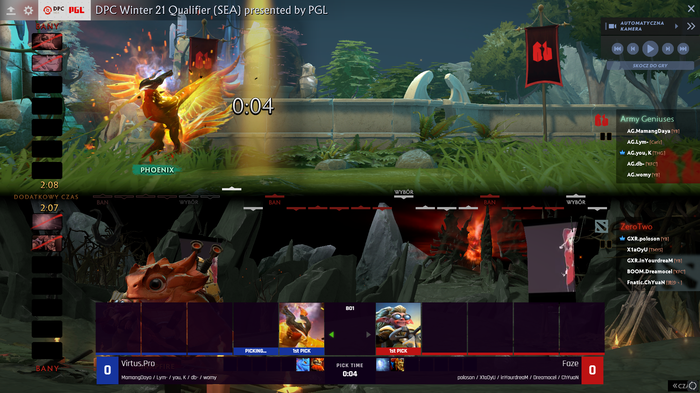
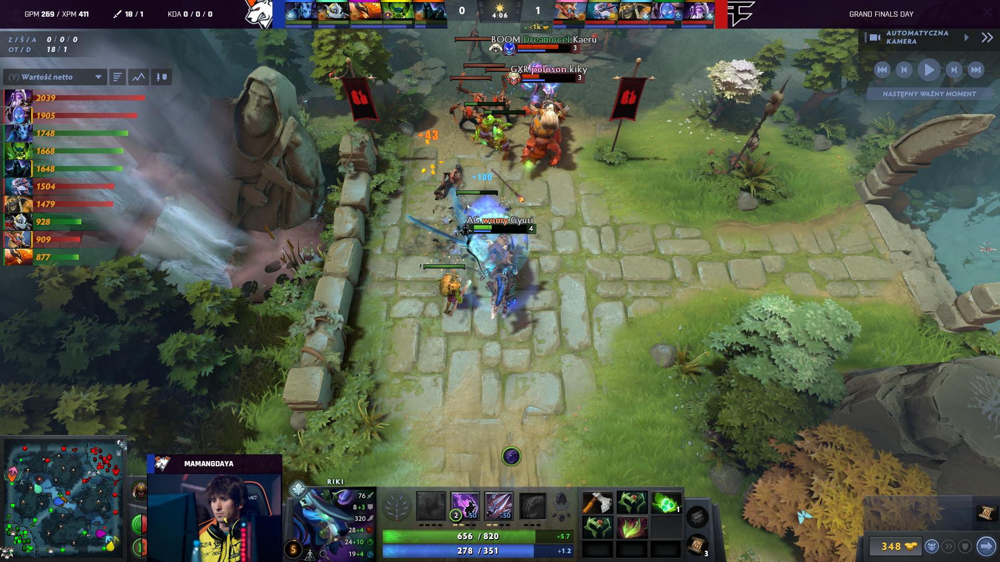
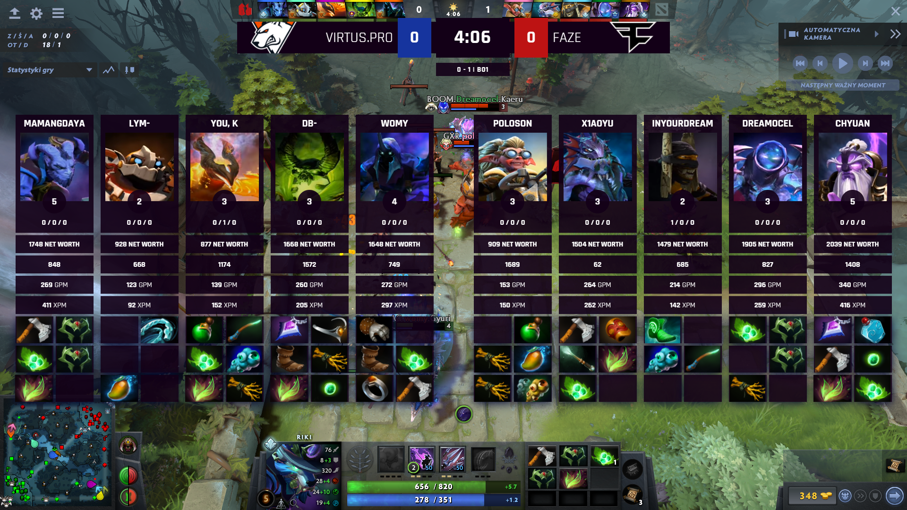

### **Dota 2 React HUD for [LHM.gg](http://LHM.gg)**

Dota2 React HUD for [LHM.gg](http://LHM.gg), created by Lexogrine, is an open source Dota 2 HUD that you can use and modify to your needs. It’s the core element of building customized Dota 2 HUDs and spectator overlays for the [LHM.gg](http://LHM.gg) platform.

It comes with a set of default options and features that you can use for creating your unique esport experience.

**Preview**  




**Download**  
To download it, simply click here: [**DOWNLOAD Dota 2 React HUD for LHM.gg**](https://lhm.gg/download?target=dota2)

**Setting up**  
Fork this repo, clone it, and then run `npm install` and `npm start`. HUD should start on the `3500` port. For this to work, have [LHM.gg](http://LHM.gg) open so it will pass Dota 2 data to the HUD.

**Building & distributing**  
To build a version to distribute and move around, in the root directory, run `npm run pack`. It will create the zip file for distribution. Now you can just drag and drop this file into the LHM.gg upload area.

##### **Signing**

To create Signed CS2 HUD for [LHM.gg](http://LHM.gg) to prevent at least from modifying compiled JavaScript files, run `npm run sign`. It's the same as `npm run pack` command but with an additional step of signing `.js` and `.css` files and `hud.json`.

**`panel.json` API**  
To get the incoming data from the HUD Manager, let's take a look at the `src/HUD/SideBoxes/SideBox.tsx` `componentDidMount()` method:

```javascript
import {configs} from  './../../App';
...
configs.onChange((data:any) => {
	if(!data) return;

	const  display = data.display_settings;

	if(!display) return;

	if(display[`${this.props.side}_title`]){
		this.setState({title:display[`${this.props.side}_title`]})
	}
	if(display[`${this.props.side}_subtitle`]){
		this.setState({subtitle:display[`${this.props.side}_subtitle`]})
	}
	if(display[`${this.props.side}_image`]){
		this.setState({image:display[`${this.props.side}_image`]})
	}
});
```

To retrieve incoming data, you should just import `configs` object and then listen for the changes with `onChange` method. Usually you want to check for the specific data, as in the callback it will always serve the full form from the Manager. However it looks different in the case of action input. In this case, let's look at the `src/HUD/Trivia/Trivia.tsx`:

```javascript
import {configs, actions} from  './../../App';
...
actions.on("triviaState", (state: any) => {
	this.setState({show:  state === "show"})
});
```

For the action input we need to import the `actions` object and create listener with the parameter on it.

## `keybinds.json` API

Keybinds API works in very similiar to `panel.json` action API. One more time the example will be from `src/HUD/Trivia/Trivia.tsx`:

```javascript
import {configs, actions} from  './../../App';
...
actions.on("toggleTrivia", () => {
	this.setState({show: !this.state.show})
});
```

For the action input we need to import the `actions` object and create listener with the parameter on it.

**`keybinds.json` API**  
Keybinds API works in very similiar to `panel.json` action API. One more time the example will be from `src/HUD/Trivia/Trivia.tsx`:

```javascript
import {configs, actions} from  './../../App';
...
actions.on("toggleTrivia", () => {
	this.setState({show: !this.state.show})
});
```

Keybinds listener works on the same object as action input, in this case however there are no parameter to retrieve.

**About Lexogrine**  
[Lexogrine](http://lexogrine.com) is an AI software development company, offering top-tier AI, web, and mobile design and development services for international companies. Alongside that, Lexogrine offers a set of web and mobile applications \- including [LHM.gg](http://LHM.gg) \- that revolutionize the way experts and specialists from different industries work together on a daily basis.

[Lexogrine](http://lexogrine.com) specializes in AI development, alongside web, mobile, and cloud development with technologies like TypeScript, Python, LLM, React, React Native, Node.js, Prisma, Medusa, Pytorch, AWS, and Google Cloud Platform.

With over 5 years of experience, Lexogrine delivered hundreds of projects, supporting companies and enterprises from all over the world.
